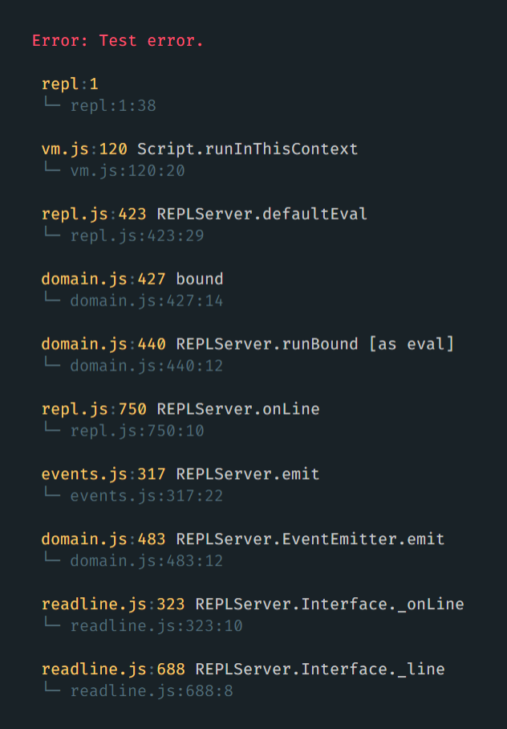

# Pretty throw [](https://travis-ci.com/Richienb/pretty-throw)

Throw formatted errors.

[](https://npmjs.com/package/pretty-throw)

## Install

```sh
npm install pretty-throw
```

## Usage

```js
const prettyThrow = require("pretty-throw");
prettyThrow(new Error("Test error."));
```

### Output



## API

### prettyThrow(error, options?)

#### error

Type: `Error`

The error to be thrown.

#### options

Type: `object`

##### exit

Type: `boolean`\
Default: `true`

Exit the process after displaying the error.
